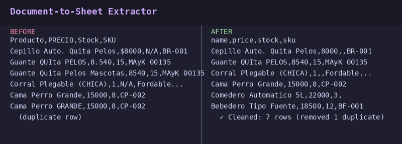

# Document-to-Sheet Extractor

**Stop manually retyping supplier PDFs and Excel files into your spreadsheets.**

If you run an e-commerce store, you know the drill: your supplier sends a price list as a PDF, or an Excel with columns in a random order, inconsistent names, and duplicate rows. You spend an hour reformatting it before you can even use it.

This tool takes that mess and outputs clean, structured data — ready to import into your store or Google Sheets.

## Before → After



**Output:** clean CSV with standardized names, prices, and no duplicates.

## Quick start

```bash
# 1. Install
pip install -r requirements.txt

# 2. Run on any PDF or Excel
python extract.py sample_data/supplier_list.pdf

# 3. Get your clean CSV
```

Your output lands in `output/` as a CSV ready to open in Excel, import to Shopify/WooCommerce, or push to Google Sheets.

## Features

- **PDF and Excel input** — detects format automatically
- **Fuzzy dedup** — catches duplicates even when names differ slightly
- **Column normalization** — maps "precio", "PRECIO", "$" to a standard format
- **Smart headers** — auto-detects which row has the column names
- **Google Sheets export** — optional, one flag away

## Example

```bash
python extract.py sample_data/supplier_list.pdf --sheets
# → prompts for Google Sheets link → pushes clean data there
```

## How it works

pdfplumber extracts tables from PDF → pandas normalizes columns → rapidfuzz catches fuzzy duplicates → clean CSV/Sheets out. Full tech details in the code.

---

**Tech stack:** Python · pdfplumber · openpyxl · pandas · rapidfuzz · gspread
